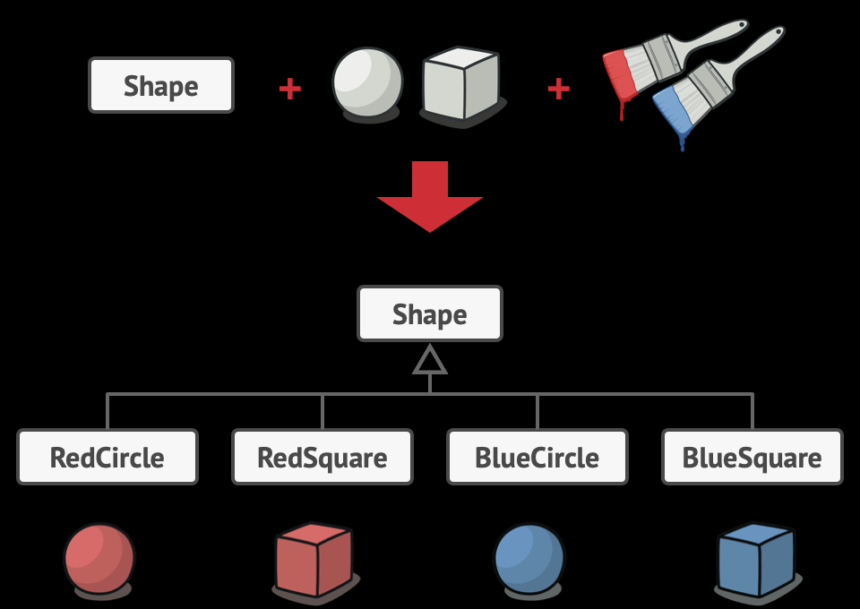
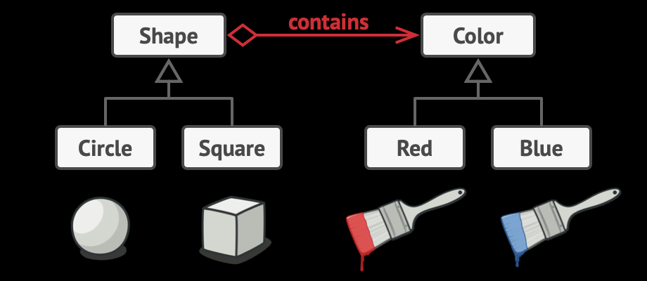
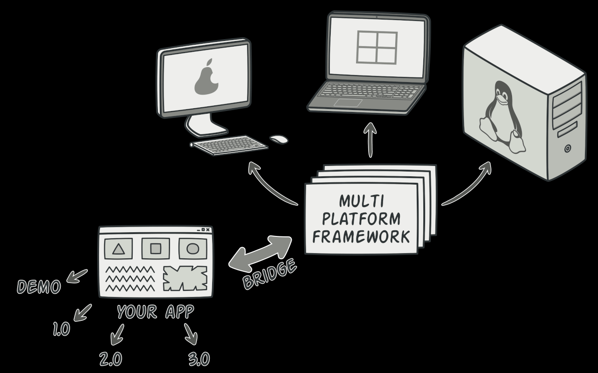
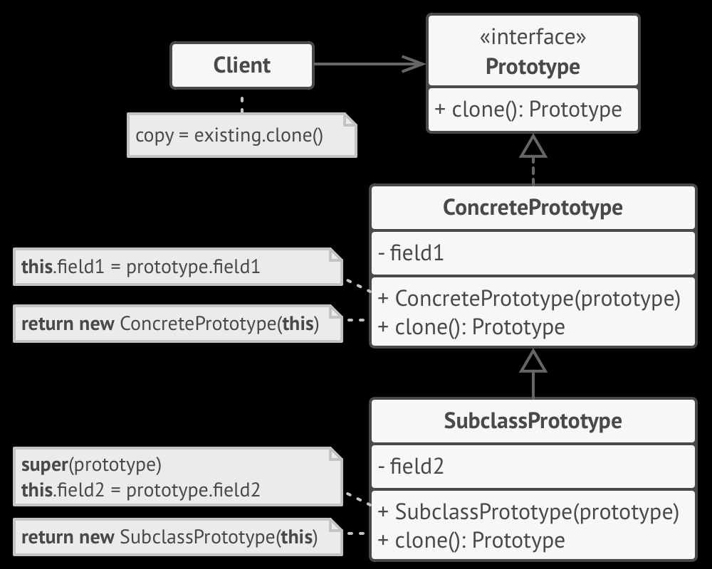
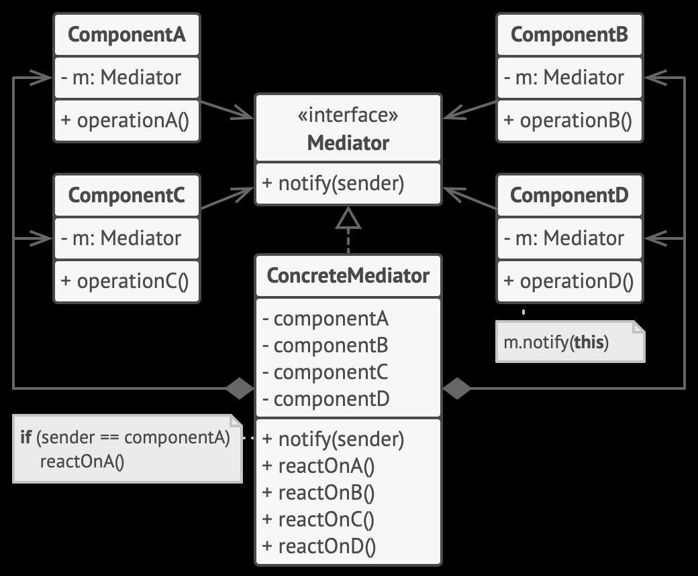

## 1. Builder Design Pattern

- creational design pattern

- step by step object creation

- when we have multiple instance variable in a class and most of them are optional.

- one option is that we might end up creating multiple constructors which makes code very lengthy and duplicated.

- another option is to use a builder design pattern and create an object by setting only necessary fields and building an object.

## 2. Adapter Design Pattern

- structural design pattern as it clubs 2 systems and creates a structure.

- it is used to make 2 systems compatible with each other.

- the very famous example is of socket and power adapter with different type of ports. we need an adapter in such case to make the power adapter compatible with socket.

- XML to JSON parsing.

- let's say server return the response in XML format but client wants it in JSON format. to make the client compatible with external system, we need an adapter that convert the incoming response from server to JSON format.


## 3. Proxy Design Pattern

- structural design pattern

- Controls access to an object, often adding additional behavior.

- Provides the same interface as the real object, allowing interchangeability.

- use cases such as Access control, caching, pre-processing, post-processing, logging, event publishing etc.

- call to system goes through the proxy.

- Proxy has an instance of actual system.

- Provides a placeholder to control access to another object.

- Applicability:
    - Lazy Initialization (virtual proxy). when we have a heavyweight service object that wastes system resources by being always up, even though we only need it from time to time.
    - Access control (protection proxy).
    - Local execution of a remote service (remote proxy).
    - Logging requests (Logging proxy).
    - Caching request results (caching proxy).


## 4. Strategy Design Pattern

- behavioral design 
- it is composition based.
- why to use:
    - let's say we have an interface vehicle and it has 5 implementations based on the category of vehicle.
    - vehicle interface has drive method which is being implemented by the subclasses of this interface.
    - but 3 subclasses have the same implementation of that drive method. (duplication of code)
    - now, we can't pull that method in the interface as well bcz other 2 subclasses have different implementation but they are also same with eachother.
    - so, we create another interface DriveStrategy and different drive strategies will implement this interface.
- lets you alter part of the object's behavior by supplying it with different strategies that correspond to that behavior.
- when to use:
    - when we have a set of different algorithms and they are not following any particular sequence or format.

## 5. Template Design Pattern

- behavioral design 
- it is inheritance based.
- lets you alter part of an algorithm by extending those parts in subclass.
- when to use:
    - when we have an algorithm with fixed set of steps and sequence and we want to have different behavior in those steps.
- Need to provide the flexibility that each class can have their own logic in that specific step.

## 6. Facade Design Pattern

- structural design pattern that provides simplified interface to complex system.
- instead of dealing with multiple classes directly, create a single class (facade) that provides a simplified and unified interface.
- when to use:
    - when we have a class with dozens of features, but you just need a tiny bit of functionality
    - an additional facade class can be created to prevent polluting a single facade with unrelated features that might make it complex structure. 
- we can reduce coupling between multiple systems by requiring them to communicate through facade.
- The facade should redirect the call from the client to appropriate objects of the subsystem.
- facade is responsible for initializing the subsystem and managing its further lifecycle.

- now the client code is decoupled from the subsystem. when a subsystem gets upgraded to a new version, you will only need to modify the code in facade.

- facade class can be transformed into singleton since the single facade object is sufficient in most cases.

```

Difference between Facade and Proxy:

- facade provides higher level interface to subsytems.

- Proxy provides the same interface as the real object, allowing interchangeability.

```

## 7. Chain Of Responsibility
- behavioral pattern
- lets u pass requests along a chain of handlers.
- upon receiving a request, handler decides either to process the request or to pass it to the next handler in the chain.
- when to use:
    - when multiple sequential checks are required before proceeding further.
    - flexibility provided here is that client can change the sequence of these checks.
    - client is not required to start the checks from the first one. It can start from any step.
    - a handler can decide not to pass the request further down the chain and effectively stop any further processing.
    - there's slightly different approach: in which, upon receiving a request, a handler decides whether it can process it. if it can, it doesn't pass the request any further. so, it is only one handler that processes the request or none at all.
- 
- Examples:
    - java.util.logging.Logger#log()


## 8. Decorator Design Pattern
- structural design pattern
- lets you attach new behaviors to objects by placing these objects inside special wrapper objects that contain the behaviors.
- the resulting object will get a stacking behavior of all wrappers.
- Examples:
    - java.io.InputStream, OutputStream, Reader and Writer have constructors that accepts objects of their own type.
    - java.util.Collections -> methods synchronizedXXX() and unmodifiableXXX()
- When to use:
    - 
    - 
    - for each permutation, we need to create a new class.
    - here, Decorator pattern comes into picture.

## 9. Observer Design Pattern
- is behavioral design pattern
- lets you define a subscription mechanism to notify multiple objects about any events that happen to the object they're observing.
- Example:
    - Product and customer:
    - whenever product is available in the store, all the interested customers should be notified.
- whenever, an important event happens to the publisher, it goes over its subscribers and calls the specific notification method on their objects.
- event subscription

## 10. Factory Design Pattern
- is a creational pattern
- provides an interface for creating objects in a superclass, but allows subclasses to alter the type of objects that will be created.
- let's we want to create an object based on some condition, and this object is being created at 1000s of places in the codebase so everywhere we will have to write a condition which leads to a lot of duplicate code. here factory comes into the picture.
- when to use:
  - when we don't know beforehand the exact types and dependencies of the objects our code should work with.
  - factory method decouples the construction code from the code that actually uses the product. Therefore it's easier to extend the product construction code independently from the rest of the code.
  - use the factory method when you want to save system resources by reusing existing objects instead of creating a new one each time.

## 11. Abstract Factory Design Pattern
- creational pattern
- lets you produce families of related objects without specifying their concrete class.
- "families of objects" example:
  - `Transport` + `Engine` + `Controls`
    - `Car` + `CombustionEngine` + `SteeringWheel`
    - `Plane`  + `JetEngine` + `Yoke`
- **Simple Factory** : it has once creation method with a large conditional that based on method parameters chooses which product class to instantiate and then return. Over time, this method might become too big, so we decide to extract parts of the method to subclasses. once we do it several times, it turns into the classic factory method pattern.

## 12. Bridge Design Pattern
- structural pattern
- lets you split a large class or set of closely related classes into 2 separate hierarchies - abstraction and implementation. which can be developed independently of each other.

- Problem:
  - 
  - adding new shape types and colors will grow this hierarchy exponentially.
- Solution:
  - this problem occurs bcz we're trying to extend shape classes in 2 independent dimensions: by form and by color.
  - bridge pattern solves this problem by switching from inheritance to object composition.
  - 
- Abstraction and Implementation:
  - GoF introduces the terms *Abstraction* and *Implementation* as part of bridge definition.
  - abstraction (also called *interface*) is a high-level control layer for some entity. this layer delegates the work to implementation layer (also called *platform*).
  - eg. real-application, the abstraction can be represented by a GUI, and implementation could be underlying OS code(API) which the GUI layer calls in response to user interactions.
  - we can extend such an app in 2 independent directions:
    - have several different GUIs (tailored for regular customers and admin)
    - support several different APIs (to be able to launch the app under windows, Linux, macOS).
  - making even a simple change to monolithic codebase is pretty hard.
  - we can bring order to this chaos by extracting the code related to specific interface-platform combinations into separate classes.
  - however, soon there will be lots of these classes bcz adding a new GUI or supporting a different API would require creating more and more classes.
  - bridge pattern suggests that we divide the classes into 2 hierarchies:
    - abstraction: GUI layer of the app.
    - Implementation: operating systems' APIs.
    - 
  - abstraction object controls the appearance of the app, delegating the actual work to linked implementation object.

- when to use:
  - when you need to extend a class in several orthogonal (independent) dimensions.
  - when you want to divide and organize a monolithic class that has several variants of some functionality (eg. if the class can work with various DB servers.)

```
Difference between strategy and Bridge Design patterns:
- bridge pattern is structural pattern (It is more about how do we build a software component.)
- strategy pattern is behavioral pattern (It is more about how do we want to run a behavior in software.)

- bridge: we can split the hierarchy of interface and class, join it with an abstract reference.
- strategy: we have more ways for doing an operation; with strategy, we can choose the algo. at run-time and can modify a single strategy without a lot of side-effects at compile-time.
```

## 12. Prototype Design Pattern
- creation pattern
- lets you copy existing objects without making your code dependent on their classes.
- Problem:
  - let's say we have an object, and want to create a copy of it.
  - one way is to create a new object of the same class then copy all the fields of existing object into new object.
  - but there's a catch. not all objects can be copied that way bcz some of the object's fields may be private and not visible outside of the object itself.
  - another catch is when we just know the object's interface, not actual concrete class. we won't be able to copy without the information of concrete class.
- prototype pattern delegates the cloning process to actual objects that are being cloned.
- 

## 13. Singleton Design Pattern
- creational pattern
- lets you ensure that a class has only one instance while providing a global access point to this instance.
- when to use:
  - when a class in your program should have just a single instance available to all clients (eg. database object shared by different parts of the program).
- Facade class can often be transformed into a singleton since a single facade object is sufficient in most cases.
## 14. Mediator Design Pattern
- behavioral pattern
- lets you reduce chaotic dependencies between objects.
- the pattern restricts communications between the objects and forces them to collaborate only via a mediator object.
- 
- when to use:
  - when it's hard to change some of the classes bcz they are tightly coupled to a bunch of other classes.
  - use the mediator when we are creating tons of component subclasses just to reuse some basic behavior in various contexts.
- examples:
  - java.util.concurrent.ExecutorService
  - java.util.concurrent.ScheduledExecutorService
```
Chain Of Responsibility:
- it passes a request sequentially along a dynamic chain of potential receivers until one of them handles it.

Mediator:
- eliminates connections between senders and receivers, forcing them to communicate indirectly via a mediator object.

Observer:
- lets receivers dynamically subscribe to and unsubscribe from receiving requests.

Facade:
- defines a simplified interface to a subsystem of objects, but it doesn't intoduce a new functionality. objects within the subsystem can communicate directly.

Mediator: 
- centralizes communication between components of the system. 
- components only know about the mediator object and don't communicate directly.

=> instead these components become dependent on a single mediator object. the goal of Observer is to establish dynamic one-way connections between objects, where some objects act as subordinates of others.
```