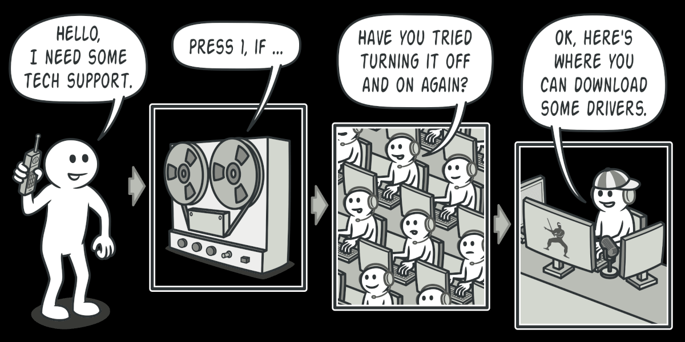
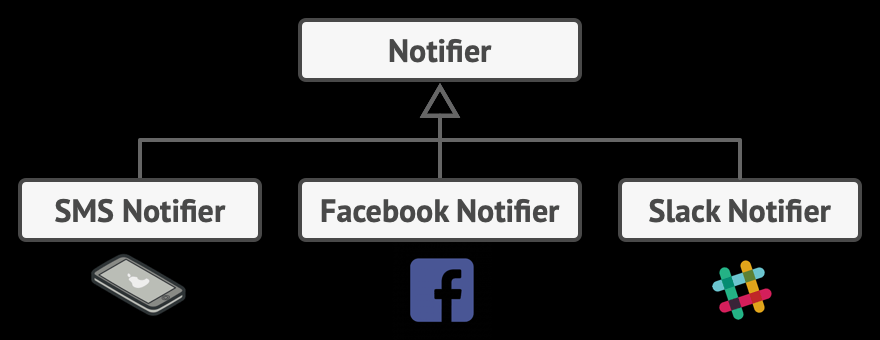
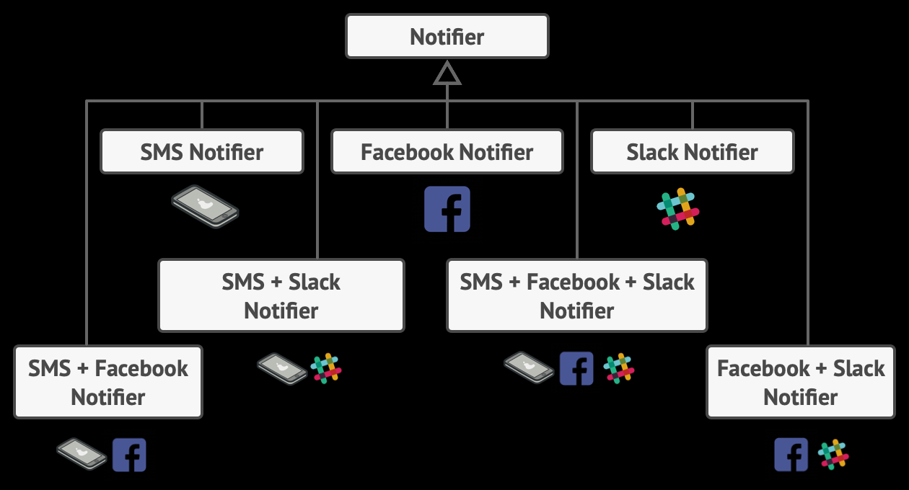

## 1. Builder Design Pattern

- creational design pattern

- step by step object creation

- when we have multiple instance variable in a class and most of them are optional.

- one option is that we might end up creating multiple constructors which makes code very lengthy and duplicated.

- another option is to use a builder design pattern and create an object by setting only necessary fields and building an object.

## 2. Adapter Design Pattern

- structural design pattern as it clubs 2 systems and creates a structure.

- it is used to make 2 systems compatible with each other.

- the very famous example is of socket and power adapter with different type of ports. we need an adapter in such case to make the power adapter compatible with socket.

- XML to JSON parsing.

- let's say server return the response in XML format but client wants it in JSON format. to make the client compatible with external system, we need an adapter that convert the incoming response from server to JSON format.


## 3. Proxy Design Pattern

- structural design pattern

- Controls access to an object, often adding additional behavior.

- Provides the same interface as the real object, allowing interchangeability.

- use cases such as Access control, caching, pre-processing, post-processing, logging, event publishing etc.

- call to system goes through the proxy.

- Proxy has an instance of actual system.

- Provides a placeholder to control access to another object.

- Applicability:
    - Lazy Initialization (virtual proxy). when we have a heavyweight service object that wastes system resources by being always up, even though we only need it from time to time.
    - Access control (protection proxy).
    - Local execution of a remote service (remote proxy).
    - Logging requests (Logging proxy).
    - Caching request results (caching proxy).


## 4. Strategy Design Pattern

- behavioral design 
- it is composition based.
- why to use:
    - let's say we have an interface vehicle and it has 5 implementations based on the category of vehicle.
    - vehicle interface has drive method which is being implemented by the subclasses of this interface.
    - but 3 subclasses have the same implementation of that drive method. (duplication of code)
    - now, we can't pull that method in the interface as well bcz other 2 subclasses have different implementation but they are also same with eachother.
    - so, we create another interface DriveStrategy and different drive strategies will implement this interface.
- lets you alter part of the object's behavior by supplying it with different strategies that correspond to that behavior.
- when to use:
    - when we have a set of different algorithms and they are not following any particular sequence or format.

## 5. Template Design Pattern

- behavioral design 
- it is inheritance based.
- lets you alter part of an algorithm by extending those parts in subclass.
- when to use:
    - when we have an algorithm with fixed set of steps and sequence and we want to have different behavior in those steps.
- Need to provide the flexibility that each class can have their own logic in that specific step.

## 6. Facade Design Pattern

- structural design pattern that provides simplified interface to complex system.
- instead of dealing with multiple classes directly, create a single class (facade) that provides a simplified and unified interface.
- when to use:
    - when we have a class with dozens of features, but you just need a tiny bit of functionality
    - an additional facade class can be created to prevent polluting a single facade with unrelated features that might make it complex structure. 
- we can reduce coupling between multiple systems by requiring them to communicate through facade.
- The facade should redirect the call from the client to appropriate objects of the subsystem.
- facade is responsible for initializing the subsystem and managing its further lifecycle.

- now the client code is decoupled from the subsystem. when a subsystem gets upgraded to a new version, you will only need to modify the code in facade.

- facade class can be transformed into singleton since the single facade object is sufficient in most cases.

```

Difference between Facade and Proxy:

- facade provides higher level interface to subsytems.

- Proxy provides the same interface as the real object, allowing interchangeability.

```

## 7. Chain Of Responsibility
- behavioral pattern
- lets u pass requests along a chain of handlers.
- upon receiving a request, handler decides either to process the request or to pass it to the next handler in the chain.
- when to use:
    - when multiple sequential checks are required before proceeding further.
    - flexibility provided here is that client can change the sequence of these checks.
    - client is not required to start the checks from the first one. It can start from any step.
    - a handler can decide not to pass the request further down the chain and effectively stop any further processing.
    - there's slightly different approach: in which, upon receiving a request, a handler decides whether it can process it. if it can, it doesn't pass the request any further. so, it is only one handler that processes the request or none at all.
- 
- Examples:
    - java.util.logging.Logger#log()


## 8. Decorator Design Pattern
- structural design pattern
- lets you attach new behaviors to objects by placing these objects inside special wrapper objects that contain the behaviors.
- the resulting object will get a stacking behavior of all wrappers.
- Examples:
    - java.io.InputStream, OutputStream, Reader and Writer have constructors that accepts objects of their own type.
    - java.util.Collections -> methods synchronizedXXX() and unmodifiableXXX()
- When to use:
    - 
    - 
    - for each permutation, we need to create a new class.
    - here, Decorator pattern comes into picture.

## 9. Observer Design Pattern
- is behavioral design pattern
- lets you define a subscription mechanism to notify multiple objects about any events that happen to the object they're observing.
- Example:
    - Product and customer:
    - whenever product is available in the store, all the interested customers should be notified.
- whenever, an important event happens to the publisher, it goes over its subscribers and calls the specific notification method on their objects.
- event subscription